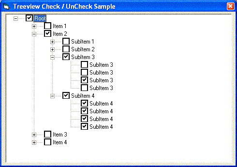



## Treeview Checkbox \(AUTO CHECK / UNCHECK, recursive for parents & childs of a node\)

### Description

This very simple function will handle all Checkboxes (parents & childs) of a TreeView control.

If you click a child node it will check all parents of this node. Also, if you "uncheck" a child node when nomore nodes are checked on the same hierarchy, this code will auto uncheck all the parents.

Simple function. Recursive calls.

The code encapsulated in a separated .BAS.

Only add this .BAS in your project and enjoy.

If you have any doubts, please let me know.

Sorry by the horrible english...

[]'s

Roberto Wolf (Brasil/SP).

MCP+Site Building
 
### More Info
 
Only pass the treeview control and a node that you need to handle.

This code don't have any side effects and in other hands, CORRECT the Checkbox bug reported by Microsoft Corp. More information see in Microsoft Web site. Article ID: Q192188 (BUG: TreeView Problems with CheckBoxes).

             |
---                |---
**Submitted On**   |2002-07-18 13:40:08
**By**             |[Roberto Wolf](https://github.com/Planet-Source-Code/PSCIndex/blob/master/ByAuthor/roberto-wolf.md)
**Level**          |Beginner
**User Rating**    |5.0 (15 globes from 3 users)
**Compatibility**  |VB 6\.0
**Category**       |[Libraries](https://github.com/Planet-Source-Code/PSCIndex/blob/master/ByCategory/libraries__1-49.md)
**World**          |[Visual Basic](https://github.com/Planet-Source-Code/PSCIndex/blob/master/ByWorld/visual-basic.md)
**Archive File**   |[Treeview\_C1077457182002\.zip](https://github.com/Planet-Source-Code/roberto-wolf-treeview-checkbox-auto-check-uncheck-recursive-for-parents-childs-of-a-node__1-37037/archive/master.zip)

